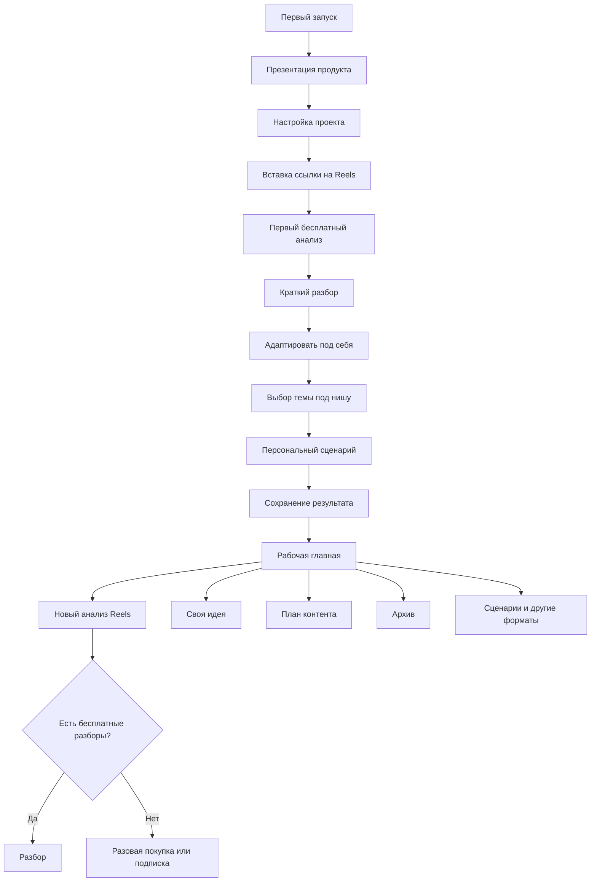

# User Journey

## TL;DR
- Первый запуск: Welcome → Quick Setup → Decoder → Adapted Topics → Personal Script → Save → Success.
- Повторный запуск: Home (рабочая) → Создать / План / Профиль.
- Точка активации = первый сохранённый сценарий.
- Точка монетизации = окончание бесплатных разборов (Free 3/мес) или value-moment.

## Когда читать этот файл
При работе с любым шагом флоу: онбординг, создание сценария, план, монетизация. Полные продуктовые правила онбординга → [[ONBOARDING]].

> [!important]
> Этот документ — единый источник правды по карте пути. Не дублируй её в других заметках.

## Карта пути

## Первый запуск
1. Welcome (`components/WelcomeScreen.tsx`): hero + 3 слайда (механика → адаптация → сценарий).
2. Quick Setup (`components/screens/CreateProjectScreen.tsx`): 8 полей.
3. Сразу попадает в проект на «Обзор» (без обязательного Decoder).
4. На «Обзоре» CTA «🛠 Открыть инструменты» → `ToolsScreen` → Decoder.
5. Decoder возвращает разбор + блок `AdaptedTopicsBlock` (3 темы).
6. Выбор темы → `PersonalScriptScreen` (генерация 20 полей).
7. Save → если первый раз, `OnboardingSuccessScreen` → возврат в проект.

## Повторный запуск
- `useWelcomeGate` определяет: есть `localStorage['lex_onboarding_completed']` или `user_prefs.onboarding_completed=true` или есть проекты → welcome не показывается.
- Пользователь попадает на Home (рабочую).

## Основной цикл ценности (loop)
1. **Вход:** ссылка на Reels или своя идея.
2. **Анализ / адаптация:** разбор + 3 темы или refine идеи.
3. **Сборка:** сценарий / карусель / подпись / пакет.
4. **Сохранение:** материал в Library и (опционально) в Plan на дату.
5. **Возврат:** уведомление, прогресс недели, streak.
6. **Снова с п.1.**

## Точки активации и монетизации
- **Активация:** первый сохранённый сценарий (Free, бесплатно).
- **Value-moment:** показ `PaywallSheet variant="value_moment"` сразу после первого сценария (см. [[MONETIZATION]]).
- **Limit-moment:** показ `PaywallSheet variant="limit_reached"` при `quota_exceeded` (402).

## Точки оттока
- Пустая Home до первого проекта — крепкий триггер «зачем я здесь».
- Quick Setup из 8 полей — длинная форма (потенциальный drop-off, отслеживать `project_created` в analytics).
- Decoder упал (приватный/удалённый Reels) — `StateBlock` с retry и переключением на другую ссылку.
- Лимит исчерпан без понимания ценности — `PaywallSheet` на этом этапе работает хуже, чем после первого сценария.

## Пустые состояния
- Library пустая → «Здесь будут все твои материалы».
- Plan пустой → «На этой неделе пусто» + CTA «Создать контент».
- Archive пустой → демо-карточка (`DEMO_REEL_DECODE`).

## Ошибки
- Сеть → `StateBlock tone=error emoji=🔌` + retry.
- Невалидная ссылка → «Не похоже на ссылку Reels» + редирект в поле.
- Приватный Reels → «Аккаунт закрыт или публикация удалена».
- 402 quota → `PaywallSheet`.

## Возврат пользователя
- Уведомления-напоминания (cron `app/api/cron/reminders/route.ts`).
- Утренний дайджест.
- Streak badge на Dashboard.

## Связанные документы
- [[ONBOARDING]]
- [[FEATURES]]
- [[MONETIZATION]]
- [[PRODUCT_DECISIONS]]
- [[02_CURRENT_STATE]]

## Связанные файлы проекта
- `components/AppFlow.tsx`
- `components/WelcomeScreen.tsx`
- `hooks/useWelcomeGate.ts`
- `components/screens/{CreateProjectScreen,ToolsScreen,PersonalScriptScreen,OnboardingSuccessScreen}.tsx`
