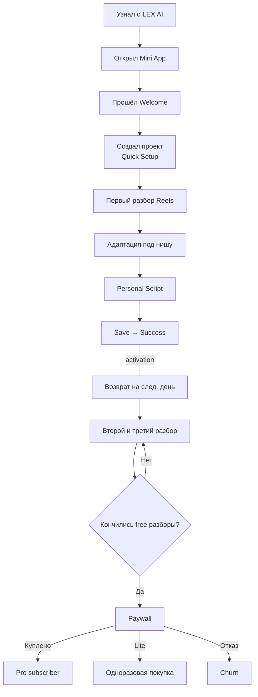

# Product Funnel

## TL;DR
- Acquisition → Activation → Retention → Revenue → Referral (AARRR).
- Сейчас фокус на **Activation** (первый сценарий) и **Revenue** (0 платящих при 341 юзере).
- Главное узкое место: Free-юзеры не превращаются в платных.

## Когда читать этот файл
При работе с конверсией, paywall, аналитикой, ретеншном.

> [!important]
> Единый источник правды по продуктовой воронке.

## Воронка (по этапам)

## Метрики (события для каждого шага)

| Шаг | Событие аналитики | Что считаем |
|---|---|---|
| Открыл Mini App | `app_opened` | DAU/MAU |
| Прошёл Welcome | `onboarding_completed` | Welcome completion rate |
| Создал проект | `project_created` | Project creation rate |
| Ввёл ссылку | `reels_link_entered` | Decoder engagement |
| Разбор завершён | `reels_analysis_completed` | Success rate (vs failed) |
| Адаптация | `adaptation_viewed`, `adaptation_topic_selected`, `own_idea_entered` | % выбравших тему vs свою идею |
| Сценарий начат | `script_generation_started` | Funnel прогресс |
| Сценарий сгенерён | `script_generated` | AI success |
| Сценарий сохранён | `script_saved` | **Activation** |
| В план | `script_added_to_plan` | Retention сигнал |
| Скопирован | `script_copied` | Использование |
| Статус изменён | `content_status_changed` | Жизненный цикл материала |
| Опубликовано | `content_marked_published` | Real-world output |
| Возврат D1/D7 | `user_returned_day_1/7` | Retention |
| Paywall открыт | `paywall_opened` | Monetization opportunity |
| Подписка | `subscription_started` | **Revenue** |
| Разовая покупка | `single_analysis_purchased` | Revenue (Lite) |

## Currently broken
- **Activation измерима, но цифра не зафиксирована** в Vault.
- **Revenue = 0** при 341 юзере, 271 проекте — главное узкое место.
- **D1/D7 retention** — события заведены, но воронка не строилась.

## Гипотезы для конверсии

### H1: Show value before paywall
Гарантировать, что Free-юзер получит первый сценарий **до** того, как увидит ценник. → Уже реализовано через `value_moment` в Paywall + первый бесплатный разбор.

### H2: Прогресс-бар «●○○»
В результатах разбора Free-юзер видит «1/3 free» — подталкивает к Pro раньше исчерпания. См. [[03_NEXT_ACTIONS]] пункт 4.

### H3: Lite-пакет как low-commitment
390₽ за 10 разборов снижает барьер vs 490₽/мес подписка. Особенно для нерегулярных юзеров. См. [[03_NEXT_ACTIONS]] пункт 6, [[10_Product/MONETIZATION]].

### H4: Reminder loop усиливает retention
Уведомления-напоминания (cron) удерживают активных. Метрика — `user_returned_day_*`.

### H5: Контент-пакет как upsell на value-moment
После 1-го сценария показать «Собери пакет с этой же идеей — 1 тап». Не реализовано.

## Точки оттока

| Этап | Причина | Mitigation |
|---|---|---|
| Welcome → Setup | 8 полей много | Ускорить, сделать чаще optional, авто-fill |
| Setup → Decoder | Не вставил ссылку | Демо-ссылка / пример |
| Decoder → Result | Приватный Reels / ошибка | StateBlock + retry + понятный текст |
| Result → Adapt | Не нашёл темы под нишу | Refine «своя идея» |
| Personal Script → Save | Не понравился сценарий | AI-actions переписывают блоки |
| После 1-го разбора → 2-й | Не вернулся | Push, reminder, streak |
| После 3-го (free) → paywall | Цена / неуверенность | Lite-пакет, value-storytelling |

## Связанные документы
- [[POSITIONING]]
- [[TARGET_AUDIENCE]]
- [[10_Product/MONETIZATION]]
- [[10_Product/USER_JOURNEY]]
- [[10_Product/FEATURES]] (раздел Analytics events)

## Связанные файлы проекта
- `lib/analytics.ts`
- `app/api/analytics/route.ts`
- `app/api/streak/route.ts`
- `components/PaywallSheet.tsx`
- `app/api/cron/reminders/route.ts`
